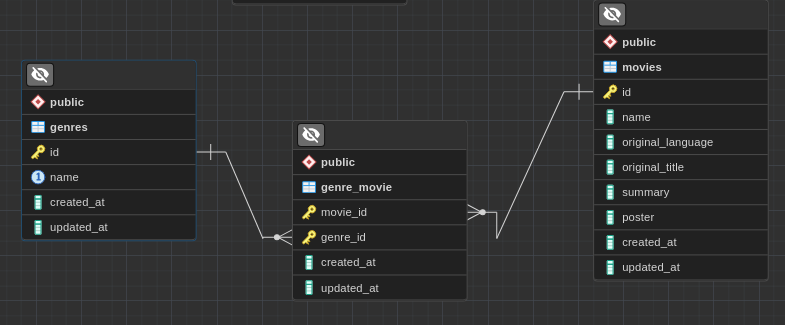

# movies app facil pos

## dev

1. proyecto desarrollado en php 8.3.0 y laravel 10
2. para probar la app neesita php y composer
3. clonado el repositorio debe instalar de****pendencias `composer install`
4. despues debe crear la base de datos que usara la app para poblar las peliculas a travez de la api
5. debe asignar las variables de entorno para la base de datos. primero copie `.env.example `y renombrelo a `.env
6. ejemplo de como deberian estar las variables de entorno de su base de datos postgres:
   
   ```
   # postgreSQL
   DB_CONNECTION=pgsql
   DB_HOST=127.0.0.1
   DB_PORT=5432
   DB_DATABASE=db_facilpos
   DB_USERNAME=jhon
   DB_PASSWORD=1234
   ```
7. ejecutar las migraciones `php artisan migrate`
8. ejecutar la app ` php artisan serve`

## modelado de datos



## codigo sql

codigo sql tambien se encuentra en la carpeta raiz del proyecto  `tables.sql`

```
CREATE TABLE movies (
    id SERIAL PRIMARY KEY,
    name VARCHAR(100),
    original_language VARCHAR(100),
    original_title VARCHAR(100),
    summary TEXT,
    poster TEXT,
    created_at TIMESTAMP DEFAULT CURRENT_TIMESTAMP,
    updated_at TIMESTAMP DEFAULT CURRENT_TIMESTAMP
);

CREATE TABLE genres (
    id SERIAL PRIMARY KEY,
    name VARCHAR(100) UNIQUE,
    created_at TIMESTAMP DEFAULT CURRENT_TIMESTAMP,
    updated_at TIMESTAMP DEFAULT CURRENT_TIMESTAMP
);

CREATE TABLE genre_movie (
    movie_id BIGINT,
    genre_id BIGINT,
    created_at TIMESTAMP DEFAULT CURRENT_TIMESTAMP,
    updated_at TIMESTAMP DEFAULT CURRENT_TIMESTAMP,
    PRIMARY KEY (movie_id, genre_id),
    FOREIGN KEY (movie_id) REFERENCES movies(id) ON DELETE CASCADE,
    FOREIGN KEY (genre_id) REFERENCES genres(id) ON DELETE CASCADE
);
```

## Algoritmo empleado en el consumo del API

```
<?php

namespace App\Utils;

use Illuminate\Support\Facades\Http;
class MoviesApi
{
    private static string $apiKey = "620e0ffa7a40a7dc31d8a2be0d18c5b9";
    private static string $endpointMovies = "https://api.themoviedb.org/3/discover/movie";
    private static string $endpoinGenres = "https://api.themoviedb.org/3/genre/movie/list";
    public static function getAllMovies()
    {
        $response = Http::get(self::$endpointMovies, [
            'api_key' => self::$apiKey,
            'include_video' => false,
            'language' => 'en-US',
            'page' => 1,
            'sort_by' => 'popularity.desc',
        ]);
        $movies = $response->json()['results'];
        return $movies;
    }

    public static function getAllGenres()
    {
        $response = Http::get(self::$endpoinGenres, [
            'api_key' => self::$apiKey,
            'language' => 'en',
        ]);
        $genres = $response->json()['genres'];
        return $genres;
    }
}

// controller
public function getMoviesFromApi()
    {
        try {
            $isMoviesCount = Movie::count();
            if ($isMoviesCount > 0) return redirect('/movies');

            $moviesFromApi = MoviesApi::getAllMovies();
            $genresFromApi = MoviesApi::getAllGenres();

            foreach ($genresFromApi as $genre) {
                if (Genre::where('name', $genre['name'])->exists()) {
                    continue;
                }

                Genre::create([
                    'name' => $genre['name'],
                    'id' => $genre['id'],
                ]);
            }

            foreach ($moviesFromApi as $movie) {
                $newMovie = Movie::create([
                    'name' => $movie['title'],
                    'original_language' => $movie['original_language'],
                    'original_title' => $movie['original_title'],
                    'summary' => $movie['overview'],
                    'poster' => "https://image.tmdb.org/t/p/w500/" . $movie['poster_path'],
                ]);
                $newMovie->genres()->attach($movie['genre_ids']);
            }
            $movies = Movie::with('genres')->get();
            return view('movies.index', compact('movies'));
        } catch (\Exception $e) {
            return response()->json(['error' => $e->getMessage()], 500);
        }
    }
```

